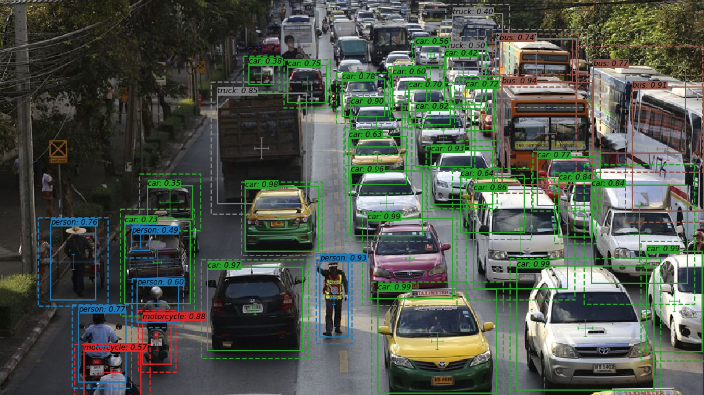
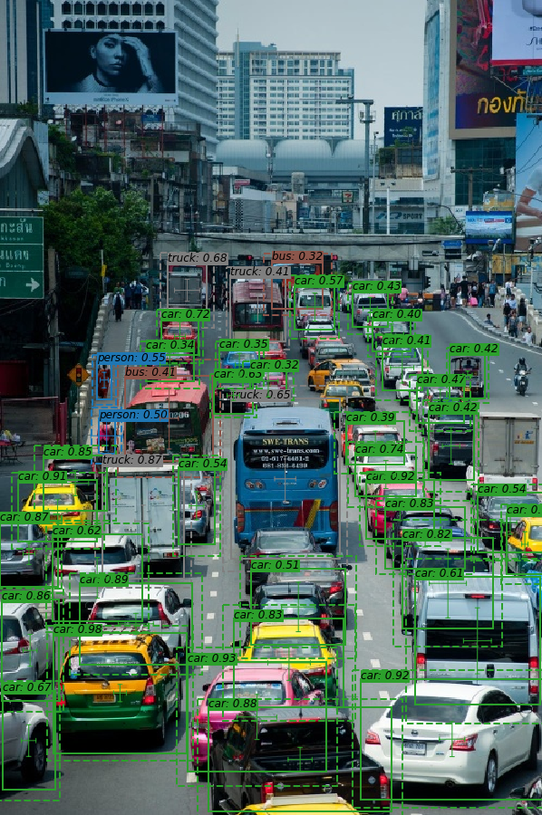
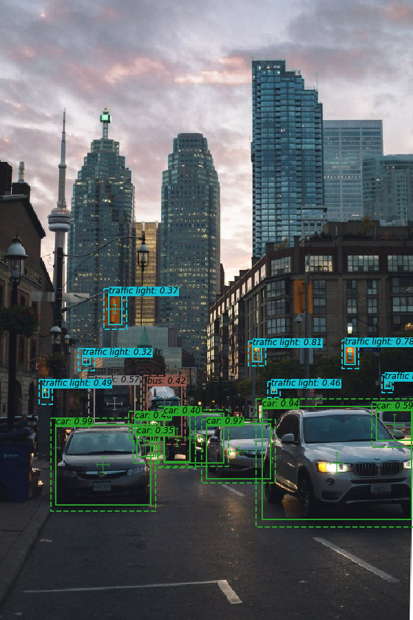
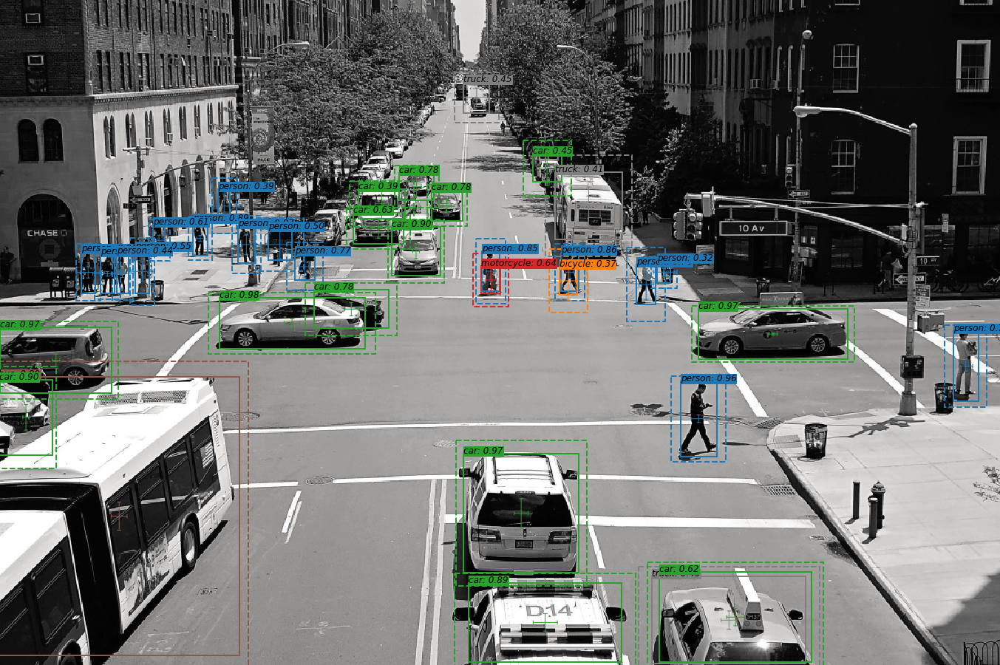
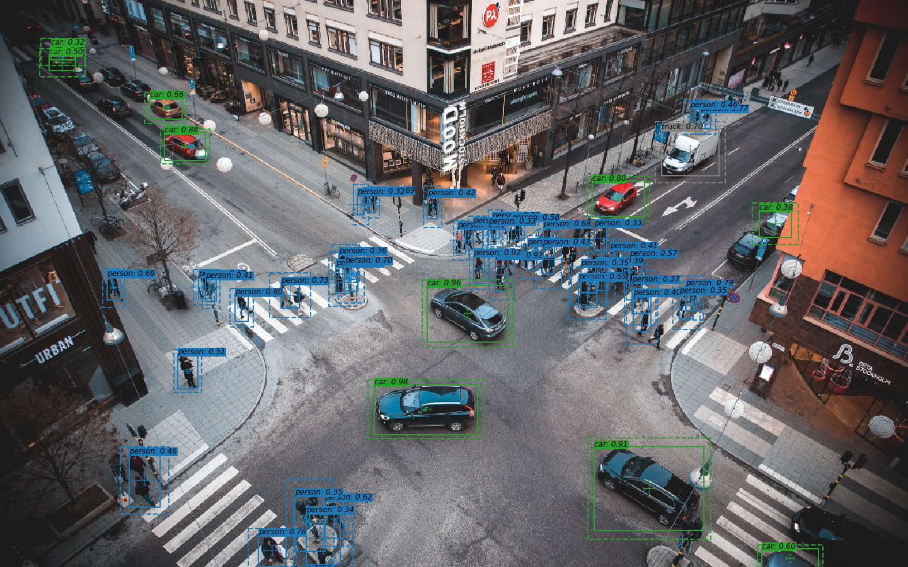

# Gaussian YOLOv3 in PyTorch
Pytorch implementation of [Gaussian YOLOv3](https://arxiv.org/abs/1904.04620)

<p align="left">
  
  
  
</p>

<p align="left">
  
  
</p>

## Performance

The benchmark results below have been obtained by training models for 500k iterations on the COCO 2017 train dataset using darknet repo and our repo.

Accordingo to the benchmark, 
**Gaussian YOLOv3 implemented in our repo achieved 30.4% in COCO AP[IoU=0.50:0.95]**, which is
2.6 ~ 2.7 point higher than the score of YOLOv3 implemented in darknet and our repo.

This gain is smaller than 3.1, the one reported in the Gaussian YOLOv3 paper.
This may come from:
- absence of `sigma_const`: Gaussian YOLOv3 official repo uses a hyper parameter `sigma_const` as an offset for uncertainties to predict but we do not use it
- gradient clipping: we use gradient clipping technique to avoid divergence during training
- difference of hyper parameters: official repo does not contain hyper parameters for COCO

|                         | YOLOv3 (darknet repo) | YOLOv3 (our repo) | Gaussian YOLOv3 (our repo) |
|-------------------------|-----------------------|-------------------|----------------------------|
| COCO AP [IoU=0.50:0.95] | 0.278                 | 0.277             | **0.304**                  |
| COCO AP [IoU=0.50]      | 0.476                 | 0.478             | **0.467**                  |

<p align="left">

Training configurations used in our repo can be found under [config dir](./config).

## Installation

#### Requirements

- Python 3.6.3+
- Numpy (verified as operable: 1.15.2)
- OpenCV
- Matplotlib
- Pytorch 1.0.0+ (verified as operable: v0.4.0, v1.0.0)
- Cython (verified as operable: v0.29.1)
- [pycocotools](https://pypi.org/project/pycocotools/) (verified as operable: v2.0.0)
- seaborn (verified as operable: v0.9.0)
- Cuda (verified as operable: v9.0)

optional:
- tensorboard (>1.7.0)
- [tensorboardX](https://github.com/lanpa/tensorboardX)
- CuDNN (verified as operable: v7.0)

#### Docker Environment

We provide a Dockerfile to build an environment that meets the above requirements.

```bash
# build docker image
$ nvidia-docker build -t yolov3-in-pytorch-image --build-arg UID=`id -u` -f docker/Dockerfile .
# create docker container and login bash
$ nvidia-docker run -it -v `pwd`:/work --name yolov3-in-pytorch-container yolov3-in-pytorch-image
docker@4d69df209f4a:/work$ python train.py --help
```

## Inference with Pretrained Weights

#### Download pretrained weights
download Gaussian YOLOv3 pretrained weight from [our GoogleDrive](https://drive.google.com/open?id=1zAFDSga9XLrsUBNHV3S2SvL1YWEsDB_p).

#### Inference with jupyter notebook
see [demo.ipynb](./demo.ipynb).

Make sure you specify the path to the pretrained weight correctly in the notebook.

## Train

#### Download pretrained weights
download Darknet53 pretrained weights from the author's project page:   

```bash
$ mkdir weights
$ cd weights/
$ bash ../requirements/download_weights.sh
```

#### COCO 2017 dataset:
the COCO dataset is downloaded and unzipped by:   

```bash
$ bash requirements/getcoco.sh
```

#### Training
```bash
$ python train.py --help
usage: train.py [-h] [--cfg CFG] [--weights_path WEIGHTS_PATH] [--n_cpu N_CPU]
                [--checkpoint_interval CHECKPOINT_INTERVAL]
                [--eval_interval EVAL_INTERVAL] [--checkpoint CHECKPOINT]
                [--checkpoint_dir CHECKPOINT_DIR] [--use_cuda USE_CUDA]
                [--debug] [--tfboard TFBOARD]

optional arguments:
  -h, --help            show this help message and exit
  --cfg CFG             config file. see readme
  --weights_path WEIGHTS_PATH
                        darknet weights file
  --n_cpu N_CPU         number of workers
  --checkpoint_interval CHECKPOINT_INTERVAL
                        interval between saving checkpoints
  --eval_interval EVAL_INTERVAL
                        interval between evaluations
  --checkpoint CHECKPOINT
                        pytorch checkpoint file path
  --checkpoint_dir CHECKPOINT_DIR
                        directory where checkpoint files are saved
  --use_cuda USE_CUDA
  --debug               debug mode where only one image is trained
  --tfboard TFBOARD     tensorboard path for logging
```

example:   
```bash
$ python train.py --cfg config/gaussian_yolov3_default.cfg --weights_path weights/darknet53.conv.74 --tfboard log
```

The train configuration is written in yaml files located in config folder.
We use the following format:
```yaml
MODEL:
  TYPE: YOLOv3
  BACKBONE: darknet53
  ANCHORS: [[10, 13], [16, 30], [33, 23],
            [30, 61], [62, 45], [59, 119],
            [116, 90], [156, 198], [373, 326]]
  ANCH_MASK: [[6, 7, 8], [3, 4, 5], [0, 1, 2]]
  N_CLASSES: 80
  GAUSSIAN: True
TRAIN:
  LR: 0.001
  MOMENTUM: 0.9
  DECAY: 0.0005
  BURN_IN: 1000
  MAXITER: 500000
  STEPS: (400000, 450000)
  BATCHSIZE: 4
  SUBDIVISION: 16
  IMGSIZE: 608
  LOSSTYPE: l2
  IGNORETHRE: 0.7
  GRADIENT_CLIP: 2000.0
AUGMENTATION:
  RANDRESIZE: True
  JITTER: 0.3
  RANDOM_PLACING: True
  HUE: 0.1
  SATURATION: 1.5
  EXPOSURE: 1.5
  LRFLIP: True
  RANDOM_DISTORT: True
TEST:
  CONFTHRE: 0.8
  NMSTHRE: 0.45
  IMGSIZE: 416
NUM_GPUS: 1
```

## Evaluate COCO AP

```bash
$ python train.py --cfg config/gaussian_yolov3_eval.cfg --eval_interval 1 [--ckpt ckpt_path] [--weights_path weights_path]
```

## Paper
#### Gaussian YOLOv3: An Accurate and Fast Object Detector Using Localization Uncertainty for Autonomous Driving
_Jiwoong Choi, Dayoung Chun, Hyun Kim, Hyuk-Jae Lee_ <br>

[[Paper]](https://arxiv.org/abs/1904.04620) [[Author's Implementation]](https://github.com/jwchoi384/Gaussian_YOLOv3)

## Credit
```
@InProceedings{Choi_2019_ICCV,
author = {Choi, Jiwoong and Chun, Dayoung and Kim, Hyun and Lee, Hyuk-Jae},
title = {Gaussian YOLOv3: An Accurate and Fast Object Detector Using Localization Uncertainty for Autonomous Driving},
booktitle = {The IEEE International Conference on Computer Vision (ICCV)},
month = {October},
year = {2019}
}
```
